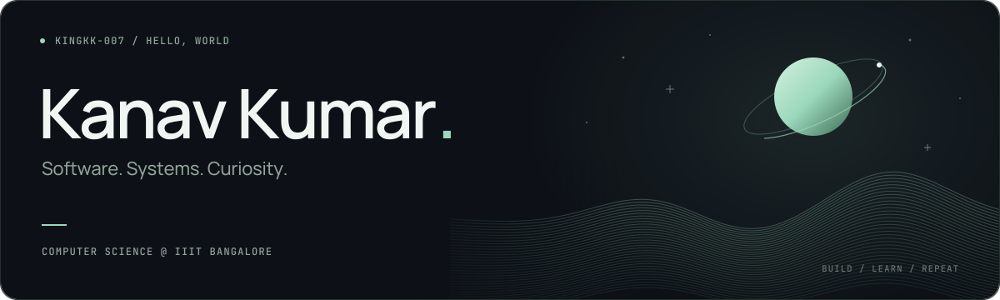
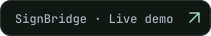
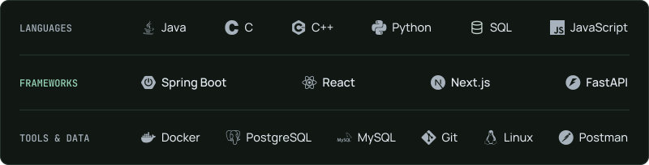

<picture>
  <source media="(max-width: 480px)" srcset="./assets/header-dark-mobile.svg" />
  <source media="(max-width: 1100px)" srcset="./assets/header-dark-compact.svg" />
  
</picture>

  
  
  
  
  

  Hey, I'm Kanav, a <strong>Computer Science undergrad at IIIT Bangalore ('28)</strong>. 
  I build software and explore <strong>AI/ML, systems and backend engineering</strong>, 
  usually by asking what happens under the hood.

  Away from the keyboard: cricket, gym, travelling and far too many jerseys. 
  Usually followed by “just one more episode.”

<h3 align="center">Selected work</h3>

  <a href="https://github.com/COolAlien35/PitchPerfect">
    <picture>
      <source media="(max-width: 480px)" srcset="./assets/projects/pitchperfect-mobile.svg" />
      <source media="(max-width: 1100px)" srcset="./assets/projects/pitchperfect-compact.svg" />
      
    </picture>
  </a>

  
  
  

  

<h3 align="center">My toolkit</h3>

  <picture>
    <source media="(max-width: 480px)" srcset="./assets/editorial/toolkit-mobile.svg" />
    <source media="(max-width: 1100px)" srcset="./assets/editorial/toolkit-compact.svg" />
    
  </picture>

<h3 align="center">On GitHub</h3>

  <picture>
    <source media="(max-width: 480px)" srcset="./assets/stats/overview-mobile.svg" />
    <source media="(max-width: 1100px)" srcset="./assets/stats/overview-compact.svg" />
    
  </picture>

  <a href="https://raw.githubusercontent.com/KINGKK-007/KINGKK-007/main/assets/stats/contributions.svg">
    <picture>
      <source media="(max-width: 480px)" srcset="./assets/stats/contributions-mobile.svg" />
      <source media="(max-width: 1100px)" srcset="./assets/stats/contributions-compact.svg" />
      
    </picture>
  </a>

<h3 align="center">Along the way</h3>

  
  
  

  <picture>
    <source media="(max-width: 480px)" srcset="./assets/editorial/footer-mobile.svg" />
    <source media="(max-width: 1100px)" srcset="./assets/editorial/footer-compact.svg" />
    
  </picture>

