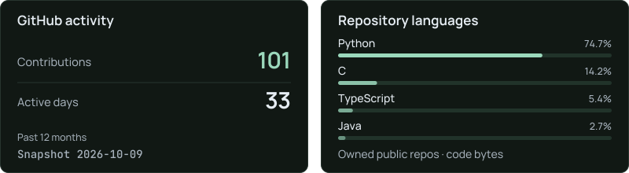

<picture>
  <source media="(max-width: 480px)" srcset="./assets/header-dark-mobile.svg?v=85476883bd" />
  <source media="(max-width: 1100px)" srcset="./assets/header-dark-compact.svg?v=f63324c7c4" />
  
</picture>

  
  
  
  
  

  Hey, I'm Kanav, a <strong>Computer Science undergrad at IIIT Bangalore ('28)</strong>. 
  I build software and explore <strong>AI/ML, systems and backend engineering</strong>, 
  usually by asking what happens under the hood.

  Away from the keyboard: cricket, gym, travelling and far too many jerseys. 
  Usually followed by “just one more episode.”

<h3 align="center">Selected work</h3>

  <a href="https://github.com/COolAlien35/PitchPerfect">
    <picture>
      <source media="(max-width: 480px)" srcset="./assets/projects/pitchperfect-mobile.svg?v=b108d518b0" />
      <source media="(max-width: 1100px)" srcset="./assets/projects/pitchperfect-compact.svg?v=322381a283" />
      
    </picture>
  </a>

<table align="left">
  <tr><td>
    <a href="https://github.com/Jdsb06/SmartCampus"><picture><source media="(max-width: 360px)" srcset="./assets/projects/smartcampus-narrow.svg?v=680409c6f9" /><source media="(max-width: 480px)" srcset="./assets/projects/smartcampus-mobile.svg?v=b6f44bcf17" /><source media="(max-width: 1100px)" srcset="./assets/projects/smartcampus-compact.svg?v=b61a45688c" /></picture></a> 
    <a href="https://github.com/Jdsb06/SmartCampus"><picture><source media="(max-width: 360px)" srcset="./assets/projects/source-narrow.svg?v=b1c6cbee34" /><source media="(max-width: 480px)" srcset="./assets/projects/source-mobile.svg?v=82862bac2f" /><source media="(max-width: 1100px)" srcset="./assets/projects/source-compact.svg?v=56d230f069" /></picture></a>
  </td></tr>
</table>

<table align="right">
  <tr><td>
    <a href="https://github.com/DayalGupta03/Sign_Bridge1"><picture><source media="(max-width: 360px)" srcset="./assets/projects/signbridge-narrow.svg?v=52f07cc10c" /><source media="(max-width: 480px)" srcset="./assets/projects/signbridge-mobile.svg?v=eca4ab969b" /><source media="(max-width: 1100px)" srcset="./assets/projects/signbridge-compact.svg?v=6cfa76844a" /></picture></a> 
    <a href="https://github.com/DayalGupta03/Sign_Bridge1"><picture><source media="(max-width: 360px)" srcset="./assets/projects/source-half-narrow.svg?v=10eb35861b" /><source media="(max-width: 480px)" srcset="./assets/projects/source-half-mobile.svg?v=dcf365cd58" /><source media="(max-width: 1100px)" srcset="./assets/projects/source-half-compact.svg?v=5e9a548ee2" /></picture></a><a href="https://sign-bridge1.vercel.app"><picture><source media="(max-width: 360px)" srcset="./assets/projects/demo-half-narrow.svg?v=5af66071ef" /><source media="(max-width: 480px)" srcset="./assets/projects/demo-half-mobile.svg?v=f9b318fb39" /><source media="(max-width: 1100px)" srcset="./assets/projects/demo-half-compact.svg?v=51fb8a6096" /></picture></a>
  </td></tr>
</table>

 

<table align="center">
  <tr><td>
    <a href="https://github.com/KINGKK-007/Mini-Swiggy"><picture><source media="(max-width: 360px)" srcset="./assets/projects/mini-swiggy-narrow.svg?v=d7c5fc87d9" /><source media="(max-width: 480px)" srcset="./assets/projects/mini-swiggy-mobile.svg?v=09fd2e6ff3" /><source media="(max-width: 1100px)" srcset="./assets/projects/mini-swiggy-compact.svg?v=bf8168ecbe" /></picture></a> 
    <a href="https://github.com/KINGKK-007/Mini-Swiggy"><picture><source media="(max-width: 360px)" srcset="./assets/projects/source-narrow.svg?v=b1c6cbee34" /><source media="(max-width: 480px)" srcset="./assets/projects/source-mobile.svg?v=82862bac2f" /><source media="(max-width: 1100px)" srcset="./assets/projects/source-compact.svg?v=56d230f069" /></picture></a>
  </td></tr>
</table>

<h3 align="center">My toolkit</h3>

  <picture>
    <source media="(max-width: 480px)" srcset="./assets/editorial/toolkit-mobile.svg?v=e1c16f74cb" />
    <source media="(max-width: 1100px)" srcset="./assets/editorial/toolkit-compact.svg?v=cde843cd90" />
    
  </picture>

<h3 align="center">On GitHub</h3>

  <picture>
    <source media="(max-width: 480px)" srcset="./assets/stats/overview-mobile.svg" />
    <source media="(max-width: 1100px)" srcset="./assets/stats/overview-compact.svg" />
    
  </picture>

  <a href="https://raw.githubusercontent.com/KINGKK-007/KINGKK-007/main/assets/stats/contributions.svg">
    <picture>
      <source media="(max-width: 480px)" srcset="./assets/stats/contributions-mobile.svg" />
      <source media="(max-width: 1100px)" srcset="./assets/stats/contributions-compact.svg" />
      
    </picture>
  </a>

<h3 align="center">Along the way</h3>

  
  
  

  <picture>
    <source media="(max-width: 480px)" srcset="./assets/editorial/footer-mobile.svg?v=20b87c684f" />
    <source media="(max-width: 1100px)" srcset="./assets/editorial/footer-compact.svg?v=b20c57d013" />
    
  </picture>

