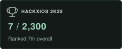
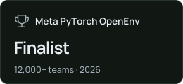
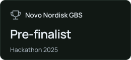

<picture>
  <source media="(max-width: 600px) and (prefers-color-scheme: dark)" srcset="./assets/header-dark-mobile.svg" />
  <source media="(max-width: 600px) and (prefers-color-scheme: light)" srcset="./assets/header-light-mobile.svg" />
  <source media="(prefers-color-scheme: dark)" srcset="./assets/header-dark.svg" />
  <source media="(prefers-color-scheme: light)" srcset="./assets/header-light.svg" />
  
</picture>

  

  &nbsp;
  &nbsp;
  &nbsp;
  &nbsp;
  

<!-- About copy and line wrapping are maintained in scripts/profile_design.py. -->
<h3 align="center"></h3>

  <picture>
    <source media="(max-width: 600px)" srcset="./assets/editorial/about-mobile.svg" />
    
  </picture>

<h3 align="center"></h3>

   
  &nbsp;
  &nbsp;
  &nbsp;
  &nbsp;
  &nbsp;
  

   
  &nbsp;
  &nbsp;
  &nbsp;
  

  TOOLS & DATA  
  &nbsp;
  &nbsp;
  &nbsp;
  &nbsp;
  &nbsp;
  

<h3 align="center"></h3>

  <picture>
    <source srcset="https://raw.githubusercontent.com/KINGKK-007/KINGKK-007/output/activity.svg" />
    
  </picture>
  <picture>
    <source srcset="https://raw.githubusercontent.com/KINGKK-007/KINGKK-007/output/languages.svg" />
    
  </picture>

<picture>
  <source media="(prefers-color-scheme: dark)" srcset="https://raw.githubusercontent.com/KINGKK-007/KINGKK-007/output/snake-dark.svg" />
  <source media="(prefers-color-scheme: light)" srcset="https://raw.githubusercontent.com/KINGKK-007/KINGKK-007/output/snake.svg" />
  
</picture>

<h3 align="center"></h3>

  
  
  
  

<h3 align="center"></h3>

  
  
  

