<picture>
  <source media="(prefers-color-scheme: dark)" srcset="./assets/header-dark.svg" />
  <source media="(prefers-color-scheme: light)" srcset="./assets/header-light.svg" />
  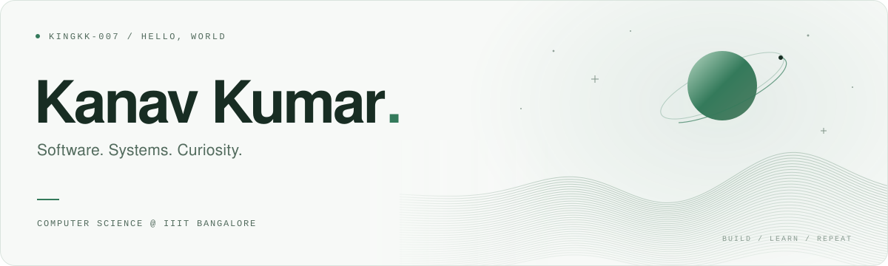
</picture>

  Fueled by caffeine and questionable Git commits.

  <a href="https://www.linkedin.com/in/kanavkumar007/">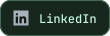</a>
  
  
  
  <a href="https://dev.to/kingkk007">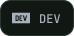</a>

 

<h3 align="center">A little about me</h3>

  Hey, I'm Kanav. I'm studying <strong>Computer Science at IIIT Bangalore</strong>, graduating in <strong>2028</strong>. 
  I like asking questions and sticking with something until it finally makes sense.

  Lately, I've been getting deeper into <strong>AI/ML, systems, and backend engineering</strong>. 
  I enjoy figuring out how things work under the hood, even when it means learning from my own bugs.

  Outside coding, I'm into <strong>cricket, the gym, travelling, and collecting way too many jerseys</strong>. 
  I also keep telling myself I'll watch “just one more episode.”

<em>Ctrl + Z is a lifestyle.</em>

 

### My toolkit

  LANGUAGES  
  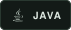
  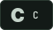
  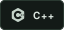
  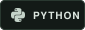
  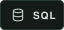
  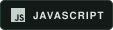

  FRAMEWORKS  
  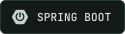
  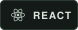
  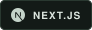
  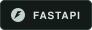

  TOOLS &amp; DATA  
  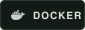
  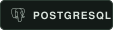
  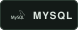
  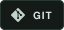
  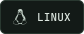
  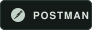

 

### On GitHub

  <picture>
    <source srcset="https://raw.githubusercontent.com/KINGKK-007/KINGKK-007/output/activity.svg" />
    
  </picture>
  <picture>
    <source srcset="https://raw.githubusercontent.com/KINGKK-007/KINGKK-007/output/languages.svg" />
    
  </picture>

<picture>
  <source media="(prefers-color-scheme: dark)" srcset="https://raw.githubusercontent.com/KINGKK-007/KINGKK-007/output/snake-dark.svg" />
  <source media="(prefers-color-scheme: light)" srcset="https://raw.githubusercontent.com/KINGKK-007/KINGKK-007/output/snake.svg" />
  
</picture>

 

<h3 align="center">A few things I've built</h3>

  <a href="https://github.com/COolAlien35/PitchPerfect">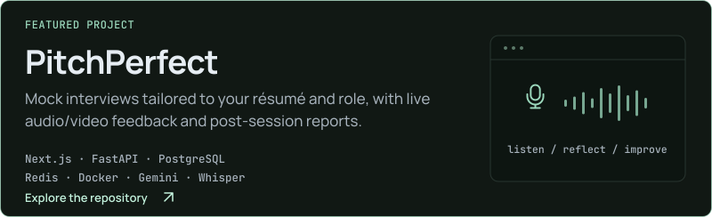</a>
  <a href="https://github.com/KINGKK-007/Mini-Swiggy">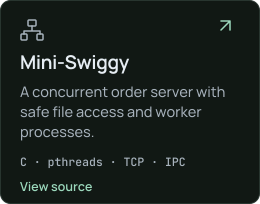</a>
  <a href="https://github.com/DayalGupta03/Sign_Bridge1">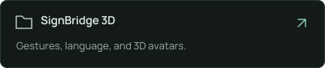</a>
  

  
A few milestones along the way

- **HackXIOS 2K25** — ranked **7th out of 2,300**.
- **Meta PyTorch OpenEnv Hackathon 2026** — finalist among **12,000+ teams**.
- **Novo Nordisk GBS Hackathon 2025** — pre-finalist.

 

Always curious. Always building.

